# Práctica 2: Pan del Alba

## Objetivo

Crear una página web básica para una panadería con Flask y Jinja2. Registrar pedidos en SQLite y conservar la base de datos mediante un volumen de Docker. Construir la imagen con un Dockerfile y ejecutar el servicio con Docker Compose.

## Herramientas

- **Flask:** microframework de Python que atiende las solicitudes HTTP y procesa el formulario.
- **Jinja2:** motor de plantillas utilizado por Flask para mostrar productos y pedidos en HTML.
- **SQLite:** base de datos en un archivo `panaderia.db`.
- **Dockerfile:** receta para construir la imagen con Python y Flask.
- **Docker Compose:** configura el servicio, el puerto 5000 y el volumen de datos.

## Procedimiento: creación de la imagen y del contenedor

Todos los comandos se ejecutan en una terminal abierta **dentro de la carpeta `panaderia`**, donde están `Dockerfile` y `docker-compose.yml`. Docker Desktop debe estar iniciado.

### Paso 1. Preparar los archivos de la aplicación

Se crearon `app.py`, `requirements.txt`, `templates/index.html` y `static/style.css`. `app.py` inicia Flask en el puerto 5000 y usa la variable `DATABASE_PATH` para ubicar el archivo SQLite. `requirements.txt` indica que hay que instalar Flask. Las carpetas `templates` y `static` contienen la página Jinja2 y el CSS.

**Comprobación:** en esta carpeta deben verse esos archivos antes de construir la imagen.

**Evidencia visual:** el código de Flask crea la tabla de pedidos y la plantilla Jinja2 define la página.

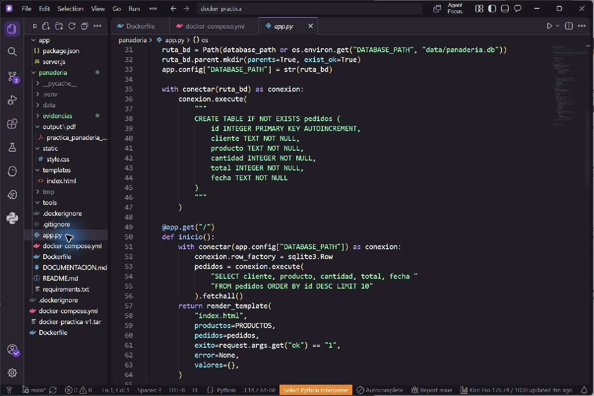

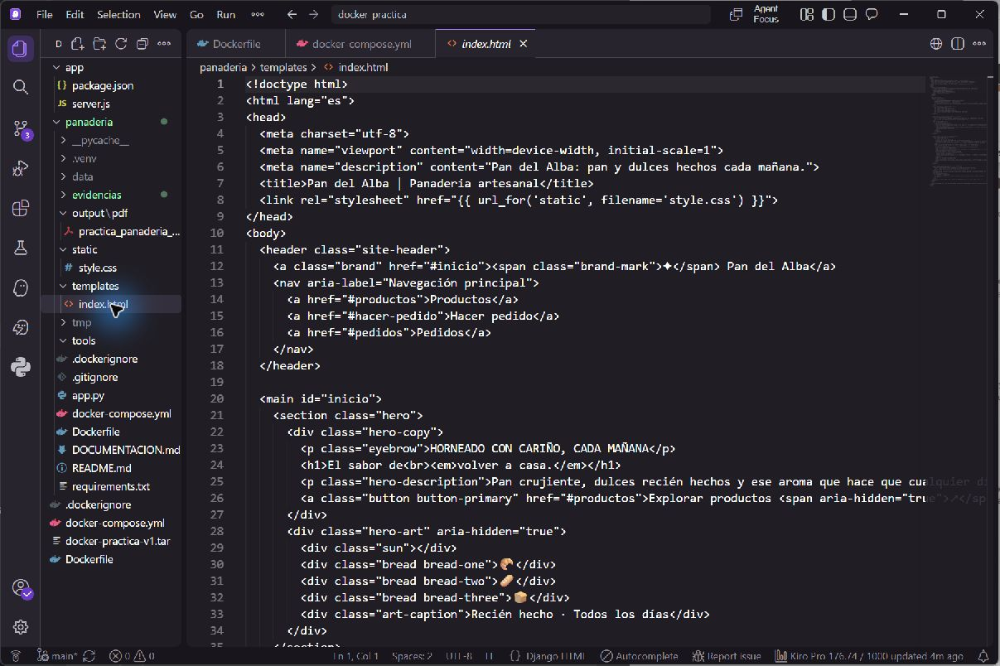

### Paso 2. Escribir el Dockerfile

El archivo [Dockerfile](Dockerfile) contiene estas instrucciones:

| Instrucción | Función |
| --- | --- |
| `FROM python:3.12-slim` | Usa Python como base de la imagen. |
| `WORKDIR /app` | Establece la carpeta de trabajo dentro de la imagen. |
| `COPY requirements.txt .` y `RUN pip install ...` | Copia e instala Flask. |
| `COPY app.py .`, `COPY templates/ ...`, `COPY static/ ...` | Añade el código y el diseño de la web. |
| `ENV DATABASE_PATH=/app/data/panaderia.db` | Indica dónde guardar la base de datos. |
| `EXPOSE 5000` | Documenta el puerto usado por Flask. |
| `CMD ["python", "app.py"]` | Arranca la aplicación al iniciar el contenedor. |

`EXPOSE` solo documenta el puerto interno. La publicación hacia la computadora se hace en Compose.

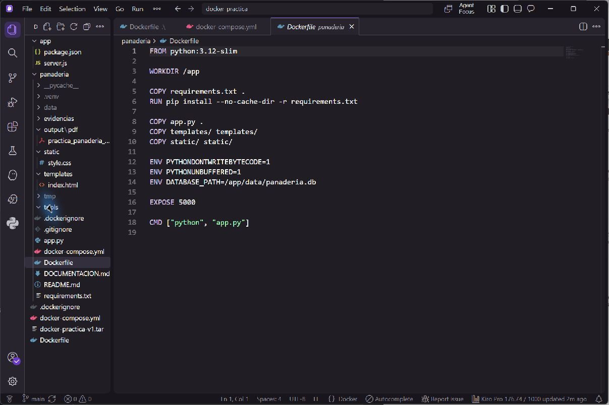

### Paso 3. Escribir Docker Compose y definir el volumen

El archivo [docker-compose.yml](docker-compose.yml) define el servicio `web`. `build: .` señala el Dockerfile de esta carpeta; `ports: "5000:5000"` conecta el puerto de la computadora con el del contenedor; `DATABASE_PATH` apunta a `/app/data/panaderia.db`; y `pedidos_data:/app/data` monta el volumen donde queda SQLite.

Se puede revisar la configuración sin crear nada:

```powershell
docker compose config
```

**Resultado esperado:** aparecen el servicio `web`, el puerto 5000 y el volumen `pedidos_data` montado en `/app/data`.

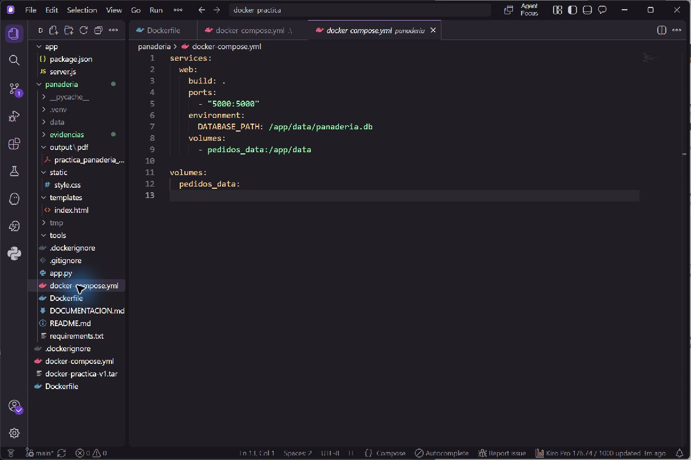

### Paso 4. Construir la imagen

```powershell
docker compose build
docker image ls panaderia-web
```

`docker compose build` lee el Dockerfile, descarga la base Python si hace falta, instala Flask y crea la imagen local `panaderia-web`. El segundo comando permite comprobar que la imagen existe. **En este paso todavía no se crea el contenedor.**

**Evidencia visual del resultado:** la imagen `panaderia-web:latest` aparece en Docker Desktop. Esta captura comprueba que la imagen existe; no es una captura del comando durante su ejecución.

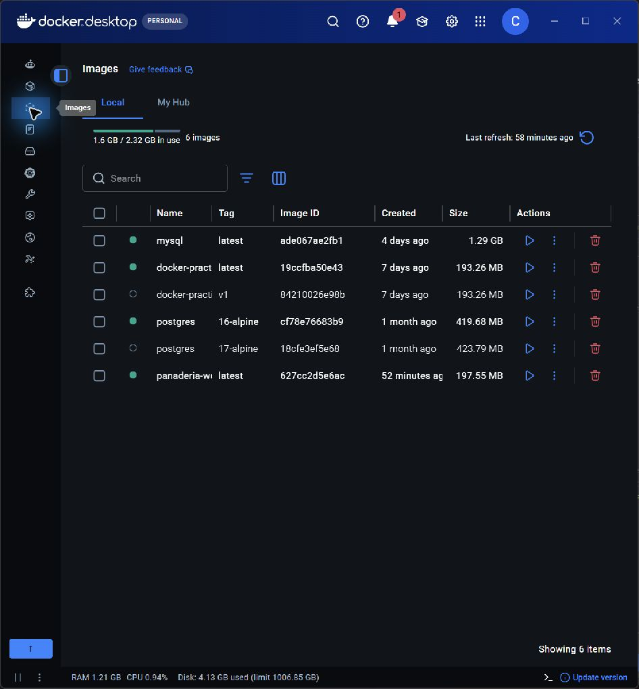


### Paso 5. Crear e iniciar el contenedor

```powershell
docker compose up -d
docker compose ps
docker compose logs web
```

`up -d` crea e inicia el contenedor `panaderia-web-1`, además de la red y el volumen si aún no existen. `ps` debe mostrar el estado `running` y el puerto `5000:5000`. En `logs web` debe aparecer que Flask atiende en el puerto 5000.

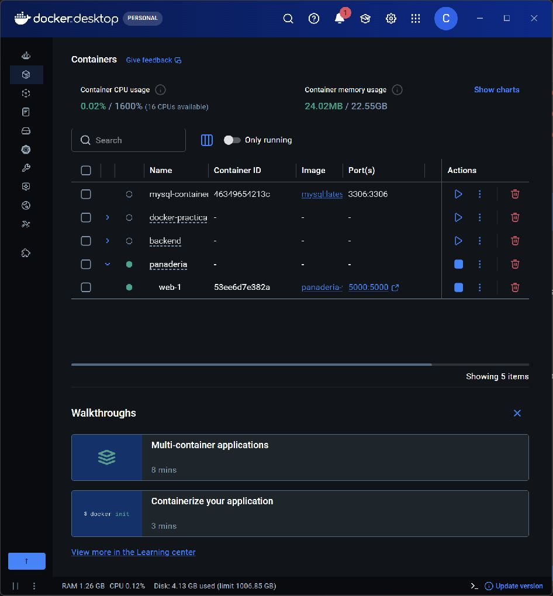

### Paso 6. Probar la página y guardar un pedido

Abre <http://localhost:5000>. Comprueba el catálogo, llena el formulario y envía un pedido. Debe aparecer en **Pedidos recientes**. En la prueba realizada se guardaron tres marraquetas para `Pedido de prueba`, con total **Bs 6**.

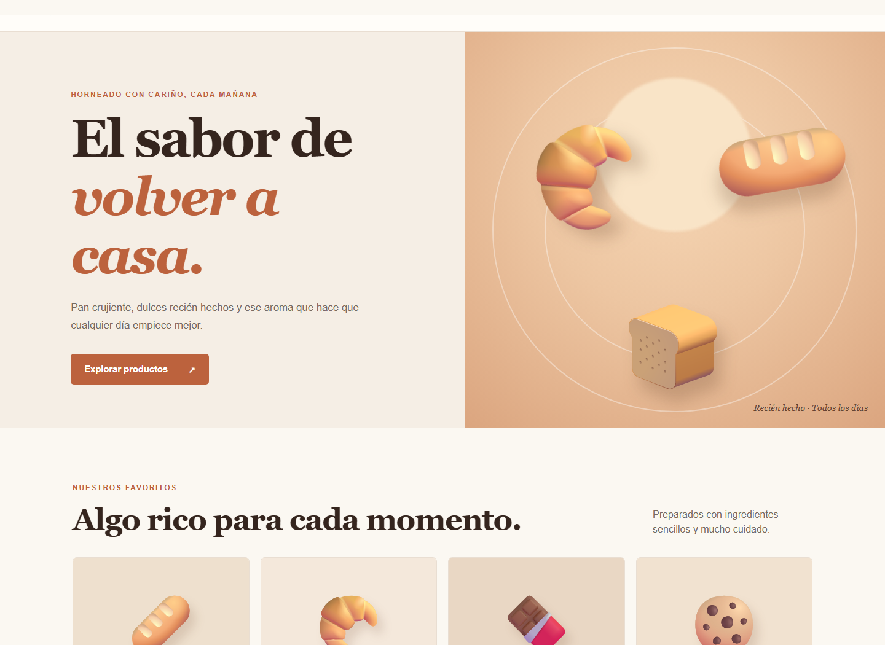

### Paso 7. Demostrar que los datos sobreviven al contenedor

```powershell
docker compose down
docker compose up -d
docker compose ps
```

`down` elimina el contenedor y la red, pero conserva el volumen. `up -d` crea otro contenedor y monta el mismo volumen. Al recargar <http://localhost:5000>, el pedido debe seguir en **Pedidos recientes**. En nuestra ejecución el ID del contenedor cambió de `4481c631a587` a `53ee6d7e382a` y el pedido permaneció.

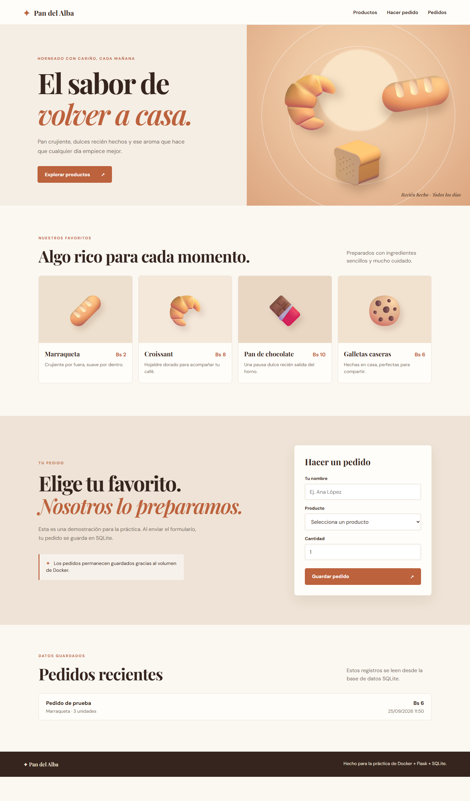

### Paso 8. Verificar el volumen

```powershell
docker volume ls
docker volume inspect panaderia_pedidos_data
```

Compose creó el volumen con el nombre completo `panaderia_pedidos_data`. Ahí se conserva el archivo SQLite que Flask usa en `/app/data/panaderia.db`. Para detener el proyecto conservando los datos, usa `docker compose down`. **No uses `docker compose down --volumes` durante esta demostración**, porque ese comando sí elimina el volumen.

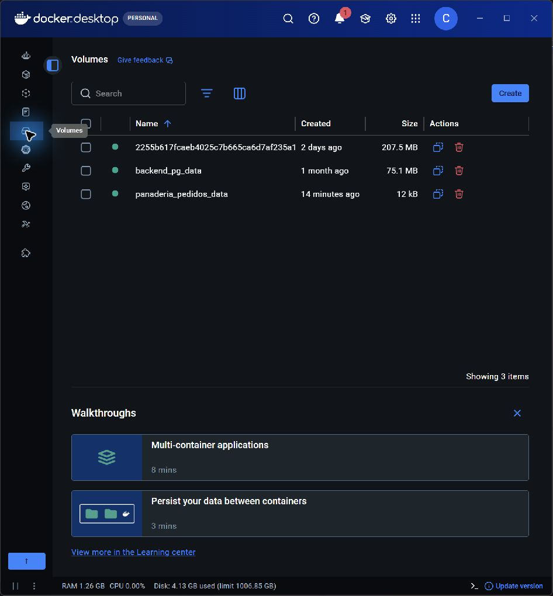

## Recorrido adicional por terminal (referencia: práctica 2 del docente)

La guía del docente usa Node.js y el puerto 3000 como ejemplo. Aquí se siguió **el mismo recorrido conceptual con la aplicación real de Pan del Alba**, hecha en Flask y publicada en el puerto 5000. Estos comandos se ejecutaron el 25/09/2026 desde PowerShell, dentro de `panaderia`. Se conservaron el servicio principal de Compose en `localhost:5000` y sus pedidos; la prueba directa usa `localhost:5001` para evitar conflictos de puertos.

Las capturas 13 a 15 del anexo son imágenes reales de PowerShell. Documentan los intentos iniciales y sus correcciones: primero se ejecutó `docker build` desde `system32`, luego se cambió a la carpeta del proyecto; para el bind mount se definió `$static` antes de ejecutar Docker.

### Construcción directa de la imagen (pasos 2 y 3 de la guía)

```powershell
docker build -t panaderia:practica2 .
docker image ls panaderia:practica2
```

**Resultado comprobado:** la construcción terminó correctamente y apareció `panaderia:practica2` (aproximadamente 198 MB). Docker leyó el `Dockerfile` de esta carpeta; no se creó un contenedor con `build`.

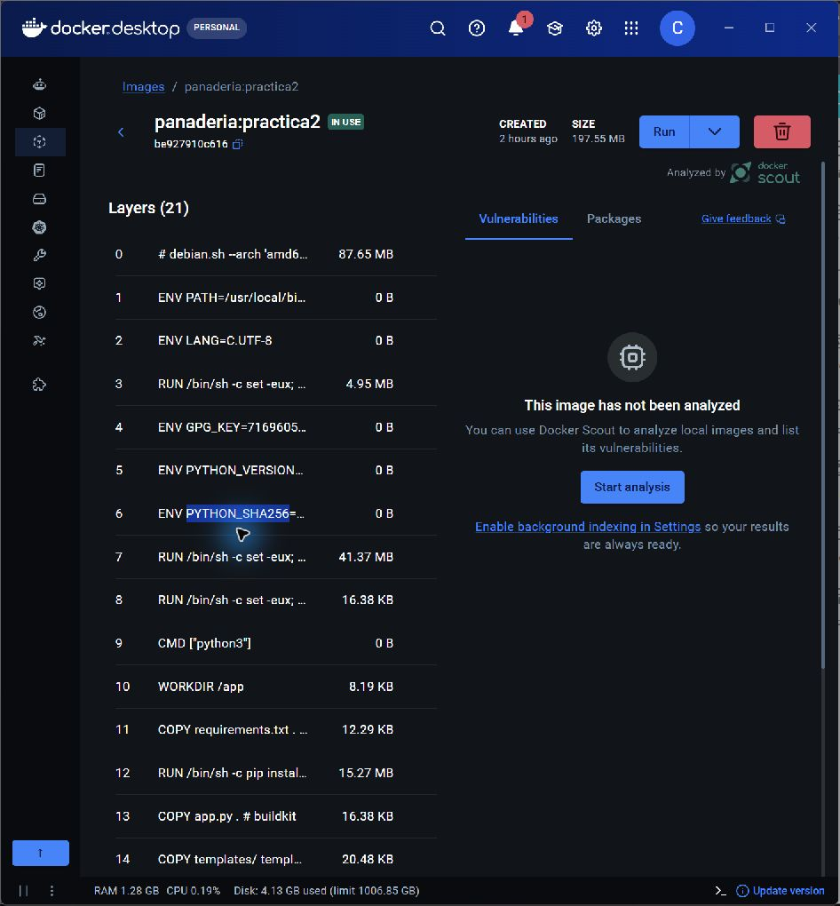

### Ejecución directa y prueba HTTP (paso 4)

```powershell
docker run -d --name panaderia-cli -p 5001:5000 -v panaderia_cli_datos:/app/data panaderia:practica2
docker ps --filter name=panaderia-cli
(Invoke-WebRequest -Uri 'http://localhost:5001' -UseBasicParsing).StatusCode
```

**Resultado comprobado:** `panaderia-cli` quedó en estado `Up`, publicó `5001:5000` y la solicitud devolvió **200**. El volumen `panaderia_cli_datos` quedó montado en `/app/data`. El contenedor original `panaderia-web-1` siguió funcionando en el puerto 5000.

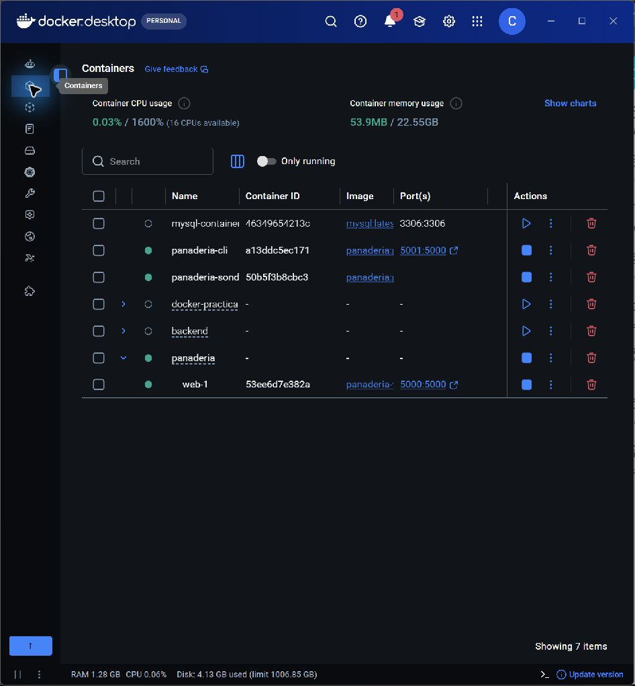

### Contexto de construcción y volumen (pasos 5 y 6)

El archivo `.dockerignore` ya excluye `.venv/`, `__pycache__/`, bases `.db`, `data/` y `output/`, para no enviar archivos locales innecesarios al construir. La persistencia de pedidos se comprobó previamente con el volumen `panaderia_pedidos_data`; la ejecución directa creó otro volumen de prueba, `panaderia_cli_datos`.

```powershell
docker inspect panaderia-cli --format '{{json .Mounts}}'
docker volume ls --filter name=panaderia_cli_datos
```

**Resultado comprobado:** Docker informó `Type: volume`, `Name: panaderia_cli_datos` y `Destination: /app/data`.

### Bind mount para desarrollo (paso 7)

Se montó la carpeta local `static/` en `/app/static` **solo para esta comprobación**, en modo de solo lectura; no se cambió el diseño ni se afirmó haber probado recarga en caliente.

```powershell
$labStatic = (Resolve-Path -LiteralPath 'static').Path
docker run --rm --mount "type=bind,source=$labStatic,target=/app/static,readonly" panaderia:practica2 python -c "from pathlib import Path; print('BIND_MOUNT_OK', Path('/app/static/style.css').is_file())"
```

**Salida real:** `BIND_MOUNT_OK True`. El contenedor temporal se eliminó solo al terminar por la opción `--rm`.

La guía pide además editar el código para incluir el nombre completo, reiniciar un contenedor de desarrollo y consultar la respuesta actualizada. Esta captura comprueba que el archivo local está montado y accesible, pero no muestra ese cambio de código ni una respuesta con el nombre; no se presenta como evidencia de esa parte.

### Red personalizada y dos contenedores (paso 8)

Se conectó el contenedor web a `panaderia-lab`. Un segundo contenedor, `panaderia-sonda`, comprobó que podía resolver `panaderia-cli` por nombre y hacer una petición HTTP dentro de la red. Aquí se usa HTTP en vez del ejemplo Redis/PONG de la guía, porque es una prueba propia de esta web.

```powershell
docker network create panaderia-lab
docker network connect panaderia-lab panaderia-cli
docker run -d --name panaderia-sonda --network panaderia-lab panaderia:practica2 sleep infinity
docker exec panaderia-sonda python -c "import urllib.request; print('RED_OK_HTTP', urllib.request.urlopen('http://panaderia-cli:5000').status)"
docker network inspect panaderia-lab --format '{{range .Containers}}{{.Name}} {{end}}'
```

**Salidas reales:** `RED_OK_HTTP 200` y los nombres `panaderia-sonda panaderia-cli` en la misma red. La sonda es un contenedor auxiliar de la demostración, no un componente necesario de la aplicación.

La captura anterior de Docker Desktop muestra ambos contenedores en ejecución; la prueba de comunicación es la salida `RED_OK_HTTP 200` obtenida en la terminal. La captura, por sí sola, no demuestra la comunicación interna.

### Docker Compose (paso 9, adaptado)

El `docker-compose.yml` del proyecto ya orquesta el servicio `web`, el puerto 5000 y `pedidos_data`. La guía muestra dos servicios como ejemplo; **este archivo principal no incluye Redis ni pretende demostrar Compose multiservicio**. La comunicación entre dos contenedores se verificó en el paso de red anterior.

```powershell
docker compose config --quiet
docker compose ps
docker compose logs --tail 4 web
```

**Resultado comprobado:** `panaderia-web-1` aparece `Up` en `5000:5000` y los registros muestran respuestas HTTP 200. Los comandos `docker run` de arriba no sustituyen ni desmontan el servicio de Compose.

Al repetir el recorrido, comprueba antes los nombres con `docker ps -a`: Docker no permite crear otro contenedor con el mismo nombre mientras `panaderia-cli` o `panaderia-sonda` existan.

## Prompts por apartado

Estos prompts se redactaron para guiar la construcción de esta práctica. Las capturas de esta sección muestran los archivos y resultados obtenidos, **no** una conversación con IA. Si el profesor solicita pruebas de una conversación, deben añadirse capturas de los mensajes que realmente se enviaron.

### 1. Idea y estructura

> Quiero hacer una práctica de Docker con una página web sencilla para una panadería. Propón una estructura de proyecto con Flask, plantillas Jinja2, CSS, SQLite, Dockerfile y Docker Compose. La web debe mostrar productos y permitir guardar pedidos.

**Resultado esperado:** estructura de carpetas y responsabilidad de cada archivo.

**Resultado visible:** `app.py`, la plantilla y el Dockerfile están presentes en el proyecto.


### 2. Diseño visual con Jinja2

> Diseña una página para una panadería llamada Pan del Alba usando HTML, CSS y plantillas Jinja2. Debe mostrar productos con precios, un formulario para registrar pedidos y una lista de pedidos guardados. Haz que se adapte a celular.

**Resultado esperado:** `templates/index.html` y `static/style.css`.


### 3. Flask y SQLite

> Crea una aplicación Flask que muestre productos, reciba un formulario de pedido y guarde nombre del cliente, producto, cantidad, total y fecha en SQLite. Valida los datos del formulario y muestra los últimos pedidos en la página.

**Resultado esperado:** `app.py`, tabla `pedidos` y formulario funcional.


### 4. Dockerfile

> Escribe un Dockerfile para una aplicación Flask de Python. Debe instalar las dependencias de requirements.txt, copiar la aplicación, exponer el puerto 5000 y arrancar el servidor. La base SQLite estará en /app/data/panaderia.db.

**Resultado esperado:** imagen construida con `docker compose up --build` o `docker build`.


### 5. Docker Compose y volumen

> Escribe un docker-compose.yml para la web Flask. Publica el puerto 5000 y monta un volumen con nombre en /app/data, de modo que panaderia.db permanezca aunque se elimine y recree el contenedor.

**Resultado esperado:** servicio `web` y volumen `pedidos_data`.


### 6. Comprobación

> Explica cómo probar la página, registrar un pedido y demostrar que sigue guardado después de ejecutar docker compose down y docker compose up -d. Incluye los comandos para ver los contenedores, registros y volúmenes.

**Resultado esperado:** evidencia de que la aplicación responde y SQLite conserva los datos.


## Cómo funciona

1. El navegador abre `http://localhost:5000`.
2. Flask muestra `templates/index.html` y le entrega la lista de productos y los pedidos obtenidos de SQLite.
3. Al enviar el formulario, Flask valida los datos e inserta el pedido en `panaderia.db`.
4. Compose monta el volumen `pedidos_data` en `/app/data`. El archivo de la base queda en ese volumen.
5. Al recrear el contenedor, Flask vuelve a leer el mismo archivo SQLite del volumen.

## Capturas realizadas

1. [Página de la panadería con el pedido persistente](evidencias/web-despues.png).
2. [Contenedor recreado y en ejecución en Docker Desktop](evidencias/docker-contenedor-despues.png).
3. [Volumen `panaderia_pedidos_data` en Docker Desktop](evidencias/docker-volumen.png).
4. [Vista inicial de la página](evidencias/web-pedidos-antes.png).
5. [Dockerfile en el editor](evidencias/dockerfile-codigo.png).
6. [Compose y volumen en el editor](evidencias/compose-volumen-codigo.png).
7. [Flask y SQLite en el editor](evidencias/flask-sqlite-codigo.png).
8. [Plantilla Jinja2 en el editor](evidencias/jinja-plantilla-codigo.png).
9. [Imagen construida en Docker Desktop](evidencias/docker-imagen.png).
10. [Ficha de la imagen con nombre completo](evidencias/docker-imagen-detalle.png).
11. [Imagen `panaderia:practica2` construida por terminal](evidencias/terminal-imagen-practica2.png).
12. [Contenedores `panaderia-cli` y `panaderia-sonda`](evidencias/terminal-contenedores-practica2.png).
13. [Terminal real: primer intento fallido y construcción correcta de la imagen](evidencias/terminal-build-real.png).
14. [Terminal real: bind mount comprobado con `BIND_MOUNT_OK True`](evidencias/terminal-bind-real.png).
15. [Terminal real: comunicación entre contenedores con HTTP 200](evidencias/terminal-red-real.png).

Para comprobar la persistencia se creó el pedido de prueba `Marraqueta · 3 unidades`, se ejecutó `docker compose down` y después `docker compose up -d`. El ID del contenedor cambió de `4481c631a587` a `53ee6d7e382a`; al recargar la página el pedido seguía visible. El volumen permaneció como `panaderia_pedidos_data`.

## GitHub

Repositorio público: <https://github.com/Chucharizard/pan-del-alba-docker>.

El historial se construyó por etapas:

1. `feat: crear web de panaderia con Flask y SQLite`
2. `build: contenerizar la app y persistir pedidos en volumen`
3. `docs: explicar arquitectura, prompts y prueba de volumen`
4. `docs: añadir evidencias reales y PDF de entrega`
5. `docs: documentar creacion de imagen y contenedor paso a paso`

## Conclusión

La práctica muestra la diferencia entre la imagen, el contenedor y el volumen: la imagen contiene la aplicación; el contenedor la ejecuta; el volumen conserva la base de datos cuando el contenedor se recrea.
